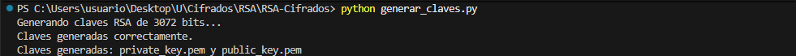
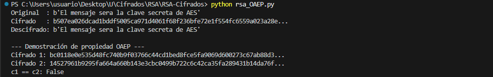
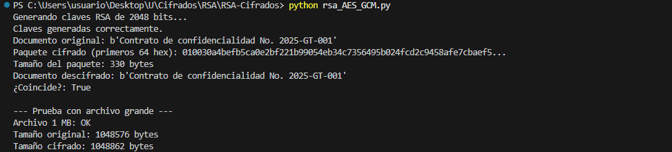

# RSA-Cifrados

**Michelle Mejía 22659**

Ejercicio RSA - Cifrados de Información
Universidad del Valle de Guatemala

---

## Descripción del Proyecto

Este proyecto implementa un sistema de cifrado híbrido RSA-OAEP + AES-256-GCM para una plataforma de transferencia de documentos legales. El sistema está diseñado para que una firma de abogados pueda transferir documentos confidenciales (contratos, acuerdos de confidencialidad, datos personales) entre sus oficinas de Guatemala City, Miami y Madrid de forma segura.

### Características principales:
- **Generación de claves RSA** de 2048/3072 bits
- **Cifrado directo RSA-OAEP** para mensajes pequeños
- **Cifrado híbrido RSA-OAEP + AES-256-GCM** para documentos de tamaño arbitrario
- Garantiza que **solo el destinatario pueda leer el documento**

---

## Instrucciones de Instalación y Uso

### Requisitos
- Python 3.8 o superior
- Biblioteca `pycryptodome`

### Instalación

```bash
# Clonar el repositorio
git clone https://github.com/michellemej22596/RSA-Cifrados.git
cd RSA-Cifrados

# Instalar dependencias
pip install pycryptodome
```

### Uso

#### 1. Generar par de claves RSA
```bash
python generar_claves.py
```
Esto generará:
- `private_key.pem` - Clave privada (protegida con passphrase "lab04uvg")
- `public_key.pem` - Clave pública



#### 2. Cifrado/Descifrado directo con RSA-OAEP
```bash
python rsa_OAEP.py
```
Este script demuestra el cifrado y descifrado directo de mensajes pequeños.



#### 3. Cifrado híbrido RSA-OAEP + AES-GCM
```bash
python rsa_AES_GCM.py
```
Este script implementa el cifrado híbrido para documentos de cualquier tamaño.


---

## Ejemplos de Ejecución

### Ejemplo 1: Generación de claves
```
$ python generar_claves.py
Generando claves RSA de 3072 bits...
Claves generadas correctamente.
Claves generadas: private_key.pem y public_key.pem
```

### Ejemplo 2: Cifrado RSA-OAEP
```
$ python rsa_OAEP.py
Original  : b'El mensaje sera la clave secreta de AES'
Cifrado   : 3a7f2b9c8d1e4f5a6b7c8d9e0f1a2b3c4d5e6f7a8b9c0d1e2f3a4b5c6d7e8f9a...
Descifrado: b'El mensaje sera la clave secreta de AES'

--- Demostración de propiedad OAEP ---
Cifrado 1: 5e8f3c2a1b4d6e7f8a9b0c1d2e3f4a5b6c7d8e9f0a1b2c3d4e5f6a7b8c9d0e1f...
Cifrado 2: 9d2c4b1a8e7f6d5c4b3a2f1e0d9c8b7a6f5e4d3c2b1a0f9e8d7c6b5a4f3e2d1c...
c1 == c2: False
```

### Ejemplo 3: Cifrado híbrido
```
$ python rsa_AES_GCM.py
Generando claves RSA de 2048 bits...
Claves generadas correctamente.
Documento original: b'Contrato de confidencialidad No. 2025-GT-001'
Paquete cifrado (primeros 64 hex): 0100a1b2c3d4e5f6789012345678901234567890...
Tamaño del paquete: 330 bytes
Documento descifrado: b'Contrato de confidencialidad No. 2025-GT-001'
¿Coincide?: True

--- Prueba con archivo grande ---
Archivo 1 MB: OK
Tamaño original: 1048576 bytes
Tamaño cifrado: 1048862 bytes
```

---

## Respuestas a las Preguntas de Análisis

### Pregunta 1: ¿Por qué no cifrar el documento directamente con RSA?

**Respuesta:**

No se debe cifrar el documento directamente con RSA por varias razonesimportantes, ejemplo:

1. **Limitación de tamaño**: RSA solo puede cifrar datos de un tamaño máximo igual a `(tamaño_clave / 8) - padding`. Por ejemplo, con una clave de 2048 bits y OAEP con SHA-256, el máximo es aproximadamente 190 bytes. Los documentos legales suelen ser mucho más grandes.

2. **Rendimiento**: RSA es un algoritmo asimétrico basado en operaciones matemáticas complejas (exponenciación modular con números muy grandes), lo que lo hace **muy lento** en comparación con algoritmos simétricos como AES. Cifrar un documento de 1 MB directamente con RSA tomaría un tiempo inaceptable.

3. **Eficiencia del cifrado híbrido**: El enfoque híbrido combina lo mejor de ambos mundos:
   - RSA (asimétrico): Se usa solo para cifrar la clave AES (32 bytes) - proporciona el intercambio seguro de claves sin necesidad de compartir secretos previamente.
   - AES-GCM (simétrico): Se usa para cifrar el documento completo - es rápido y eficiente para cualquier tamaño de datos.

---

### Pregunta 2: ¿Qué información contiene un archivo .pem?

**Respuesta:**

Un archivo `.pem` (Privacy Enhanced Mail) contiene datos criptográficos codificados en Base64 con encabezados específicos. Al abrir `public_key.pem` con un editor de texto, se observan caractéres "extraños" con la siguiente estructura:

```
-----BEGIN PUBLIC KEY-----
MIIBojANBgkqhkiG9w0BAQEFAAOCAY8AMIIBigKCAYEA... (datos en Base64)
...
-----END PUBLIC KEY-----
```

**Estructura del archivo:**
1. **Encabezado**: `-----BEGIN PUBLIC KEY-----` indica el tipo de contenido
2. **Cuerpo**: Datos codificados en Base64 que representan la clave en formato DER (ASN.1)
3. **Pie**: `-----END PUBLIC KEY-----` marca el final del bloque

**Contenido de la clave pública RSA:**
- **Módulo (n)**: El producto de los dos números primos p y q
- **Exponente público (e)**: Generalmente 65537 (0x10001)
- **Identificadores de algoritmo**: Metadatos que indican que es RSA

Para la clave privada (`private_key.pem`), además incluye:
- **Exponente privado (d)**
- **Primos p y q**
- **Parámetros CRT** (para optimización): dp, dq, qinv
- **Cifrado de la clave**: Como se protege con passphrase, el contenido está cifrado con `scryptAndAES128-CBC`

---

### Pregunta 3: ¿Por qué cifrar el mismo mensaje dos veces produce resultados distintos?

**Respuesta:**

Cifrar el mismo mensaje dos veces con RSA-OAEP produce resultados diferentes debido a la **propiedad de aleatoriedad** del padding OAEP.

**Demostración:**
```python
c1 = cifrar_con_rsa(mensaje_original, pub)
c2 = cifrar_con_rsa(mensaje_original, pub)
print(f"c1 == c2: {c1 == c2}")  # Resultado: False
```

**Explicación técnica:**

OAEP (Optimal Asymmetric Encryption Padding) utiliza un **padding aleatorio** como parte de su proceso:

1. El mensaje se combina con bytes aleatorios generados en cada operación de cifrado
2. Se aplica una función de máscara (MGF - Mask Generation Function) basada en estos bytes aleatorios
3. El resultado es un bloque con apariencia completamente aleatoria que luego se cifra con RSA

**Propiedad que lo causa: Cifrado Probabilístico (IND-CPA)**

OAEP es un esquema de **cifrado probabilístico**, lo que significa que introduce aleatoriedad deliberadamente. Esto proporciona:

- **Seguridad semántica**: Un atacante no puede distinguir entre cifrados de dos mensajes diferentes observando solo los textos cifrados
- **Resistencia a ataques de texto plano elegido (CPA)**: Incluso si el atacante puede obtener cifrados de mensajes que él elige, no puede deducir información sobre otros mensajes cifrados

**Contraste con PKCS#1 v1.5:**
El padding PKCS#1 v1.5 también introduce aleatoriedad, pero es vulnerable a ataques de oráculo de padding (Bleichenbacher). OAEP fue diseñado específicamente para eliminar estas vulnerabilidades.

---

## Estructura del Proyecto

```
RSA-Cifrados/
├── README.md                 # Este archivo
├── generar_claves.py         # Generación de claves RSA
├── rsa_OAEP.py              # Cifrado/descifrado directo RSA-OAEP
├── rsa_AES_GCM.py           # Cifrado híbrido RSA-OAEP + AES-GCM
├── private_key.pem          # Clave privada (generada al ejecutar)
└── public_key.pem           # Clave pública (generada al ejecutar)
```

---

## Referencias

- [pycryptodome Documentation](https://pycryptodome.readthedocs.io)
- [RFC 8017 — PKCS#1 v2.2 (OAEP)](https://www.rfc-editor.org/rfc/rfc8017)
- [Python secrets module](https://docs.python.org/3/library/secrets.html)
- Presentaciones de clase: https://locano-uvg.github.io/cifrados-26/
- Open AI. modelo ChatGPT versión vigente el 23 de marzo de 2026